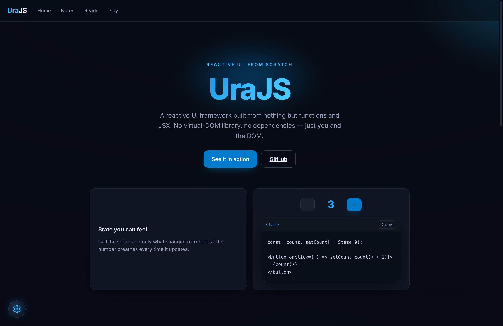
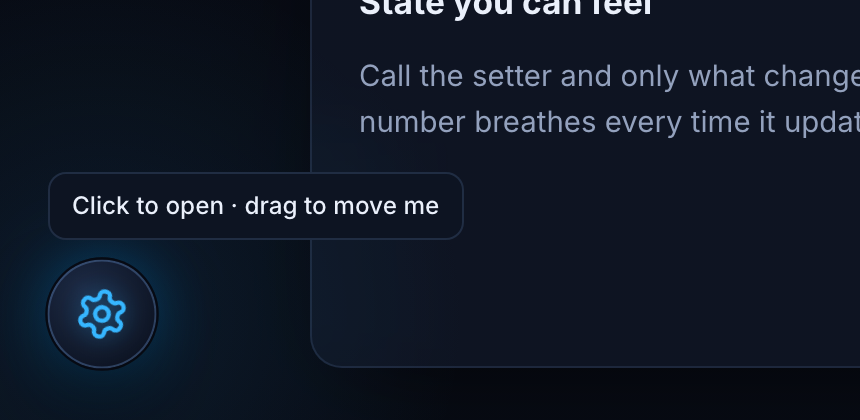
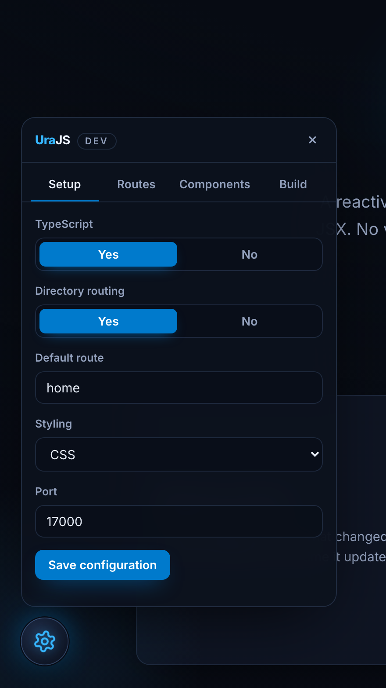
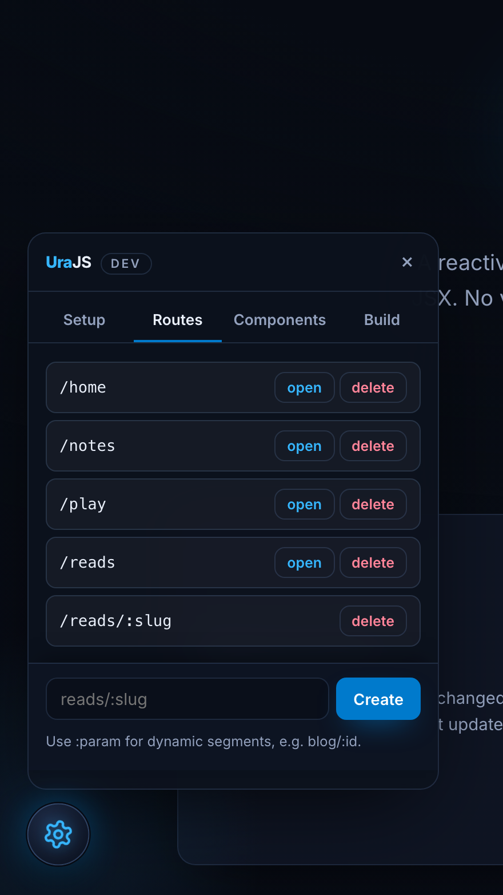
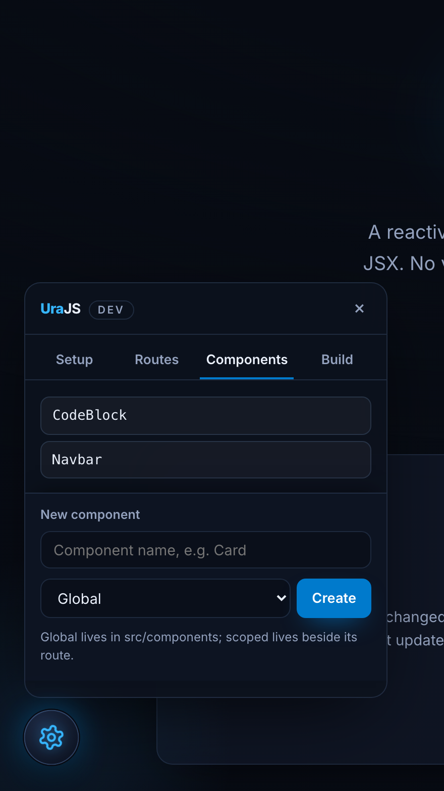
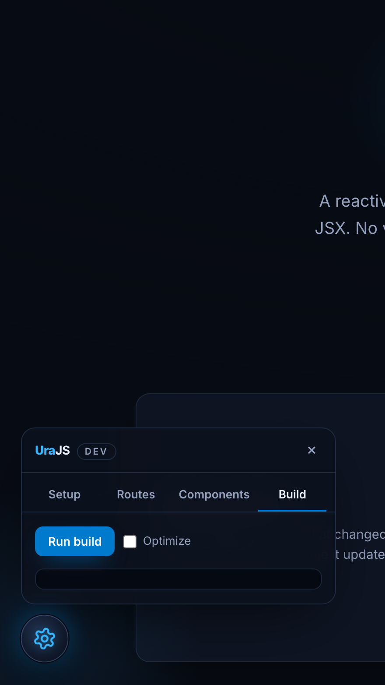

<p align="center">
  
</p>

<h1 align="center">UraJS</h1>

<p align="center">
  A small reactive UI framework built from scratch — JSX, a tiny runtime,
  directory-based routing, and zero runtime dependencies.
</p>

<p align="center">
  
</p>

---

UraJS is a single-page application framework written from the ground up. It has
its own JSX runtime (no React), a reactive `State` hook, a keyed reconciler,
file-system routing, live reload in development, and a static build that deploys
behind any web server. Pages and components can be written in `.tsx`, `.ts`,
`.jsx`, or `.js` — the default starter pages are TypeScript.

## Contents

- [Features](#features)
- [Quick start](#quick-start)
- [Project structure](#project-structure)
- [Routing](#routing)
- [Pages and components](#pages-and-components)
- [State](#state)
- [Navigation](#navigation)
- [Query params and cookies](#query-params-and-cookies)
- [Directives](#directives)
- [Keep-alive](#keep-alive)
- [Data fetching](#data-fetching)
- [CLI](#cli)
- [Dev tools](#dev-tools)
- [Configuration](#configuration)
- [Styling](#styling)
- [Build and deploy](#build-and-deploy)
- [License](#license)

## Features

- Own JSX runtime with the `Ura.e` / `Ura.fr` pragma — no virtual-DOM library.
- Reactive `State` hook with fine-grained, per-instance re-renders.
- Keyed reconciliation that preserves DOM and component state across reorders.
- Directory-based routing, including dynamic `:param` segments.
- Directives (as tags or attributes): `ura-if` / `ura-elif` / `ura-else`, `ura-loop`, `exec`,
  plus the `<get>` portal tag.
- Opt-in `keep-alive` so a route keeps its state when you navigate away and back.
- A small data layer: `useQuery` / `useMutation` and an `api` fetch helper.
- Live-reloading dev server and a dependency-free static build.

## Demo

The starter ships four small pages. Each tells one story, and together they
exercise every feature.

| Page | Story | Shows |
| --- | --- | --- |
| `/home` | Meet UraJS | `State`, conditions, keyed loops, navigation, reveal-on-scroll via `exec` |
| `/notes` | A real little app | keyed `ura-loop`, empty-state conditions, URL-synced search, cookie persistence, keep-alive |
| `/reads` | Routing + data | directory and dynamic `:slug` routing, `useQuery` + `api` over HTTP, per-slug keep-alive, dynamic title |
| `/play` | Reactive visuals | native SVG driven by `State`, an `exec` animation loop |

## Quick start

```bash
git clone https://github.com/mohammedhrima/UraJS.git
cd UraJS
npm install
npm start
```

The dev server runs on `http://localhost:17000` with live reload. Edit anything
in `src/` and the browser updates.

```bash
npm run build            # static site in out/ (plus a docker/ setup)
npm run build -- --optimize   # bundle and minify into out/app.js
```

## Project structure

```
src/
  pages/        directory routes (each folder with a page file is a route)
    home/page.tsx
    reads/:slug/page.tsx
  components/   reusable components
  services/     app code: api helper, data hooks, plain data
  ura/          the framework runtime (code.tsx, types.ts, utils.ts)
  assets/       static files copied as-is
  index.html    HTML shell (mounts into <div id="root">)
  layout.css    global styles
scripts/        the CLI (dev, build, route, comp, config, reset)
.ura/           config.json + the generated entry (main.js) — kept out of src/
```

You normally only touch `src/pages`, `src/components`, and `src/services`. The
`.ura/` folder holds your `config.json` and an auto-generated `main.js` (the entry
that imports every page) — you never edit `main.js`, and it is git-ignored.

## Routing

Routing is directory based. A folder under `src/pages` that contains a
`page.{tsx,ts,jsx,js}` file becomes a route:

```
src/pages/home/page.tsx         ->  /home
src/pages/reads/page.tsx        ->  /reads
src/pages/reads/:slug/page.tsx  ->  /reads/:slug
```

- A `:param` folder becomes a dynamic segment. Its value arrives as a prop:

  ```tsx
  function Post(props) {
    return <h1>Reading: {props.slug}</h1>;
  }
  export default { page: Post, route: "/reads/:slug" };
  ```

- Scaffolded pages export their own `route` (pre-filled with the directory path).
  The directory is the default; edit `route` to override it — that is on you.
- The `defaultRoute` in `.ura/config.json` is served at `/`.
- Any unmatched URL renders the built-in 404 page. Override it by creating
  `src/pages/404/page.tsx` — that page then handles every unmatched URL.

Generate a route from the CLI instead of creating files by hand:

```bash
npm run route reads/:slug
```

## Pages and components

A component is a function that returns JSX. Children are passed as the second
argument.

```tsx
import Ura from "ura";

function Card(props, children) {
  return (
    <section className="card">
      <h3>{props.title}</h3>
      <div>{children}</div>
    </section>
  );
}

export default Card;
```

A **page** exports a *page module* as its default — an object that carries the
component plus optional metadata:

```tsx
function Home() {
  return <h1>Home</h1>;
}

export default {
  page: Home,             // the component to render
  route: "/home",         // optional: overrides the directory-derived path
  title: "UraJS — Home",  // document.title; string or (props) => string
  keepAlive: true,        // optional: keep this page's state across navigation
};
```

`title` may be a function for dynamic routes, e.g.
`title: (props) => "Post: " + props.slug`. A bare `export default Home` also
works when you do not need metadata.

The JSX pragma is `Ura.e`, so a file that uses JSX needs `Ura` in scope. In
`.tsx`/`.ts` files import it explicitly (`import Ura from "ura"`); in `.jsx`/`.js`
files the build injects it automatically.

Element props mirror the DOM: event handlers are `on<event>` (`onclick`, `oninput`, …), `style`
takes an object (`style={{ color: "red" }}`), and classes use `className`. `onhover` is a
convenience that wires both `mouseover` and `mouseout`.

## State

`State(initial)` returns a getter and a setter. Read with the getter, update
with the setter — the component re-renders.

```tsx
import Ura, { State } from "ura";

function Counter() {
  const [count, setCount] = State(0);

  return (
    <button onclick={() => setCount(count() + 1)}>
      Clicked {count()} times
    </button>
  );
}

export default Counter;
```

Each component instance has its own state, and nested component state survives
parent re-renders.

## Navigation

```tsx
import { useNavigate } from "ura";

function Menu() {
  const navigate = useNavigate();
  return <button onclick={() => navigate("/reads")}>Reads</button>;
}
```

- `useNavigate()` returns a `navigate(path, params?)` function. Passing `params`
  appends them as a query string.
- `navigate` is also available directly: `import { navigate } from "ura"`.
- `In(path)` returns whether a path is the current route (useful for active nav
  links): `import { In } from "ura"`.
- `onNavigate(cb)` registers a callback that runs on every navigation;
  `getCurrentRoute()` returns the current path and `getRouteParams()` the matched `:params`.

## Query params and cookies

```tsx
import { getParams, setQuery } from "ura";

const q = getParams().q || "";       // read ?q=...
setQuery("q", "hello");              // set ?q=hello (null to remove)
```

```tsx
import Ura from "ura";

Ura.setCookie("token", "abc", 7);    // value, days (default 365)
Ura.getCookie("token");              // "abc" | null
Ura.rmCookie("token");
```

## Directives

**Conditionals** — `ura-if`, optional `ura-elif`, optional `ura-else`. As tags:

```tsx
<ura-if cond={score() >= 90}>Excellent</ura-if>
<ura-elif cond={score() >= 50}>Passing</ura-elif>
<ura-else>Needs work</ura-else>
```

…or as **attributes** on any element — the element itself is mounted/unmounted with the condition:

```tsx
<p ura-if={isRaining()}>Bring an umbrella</p>
<p ura-else>Skies are clear</p>
```

**Loops** — `ura-loop` takes an array on `on` and a render function as its child. Use a stable
`key` so reordering moves DOM and state by identity:

```tsx
<ura-loop on={items()}>
  {(item, index) => <li key={item.id}>{item.label}</li>}
</ura-loop>
```

**Side effects** — `exec` runs a function after the surrounding markup is in the DOM:

```tsx
<exec call={() => (document.title = "UraJS")} />
```

**Fragments** group siblings without a wrapper element:

```tsx
<>
  <span>one</span>
  <span>two</span>
</>
```

### Special tags

`<get>` is a lightweight portal: it renders its children into an element that **already exists**
in the document, selected by `by` (a CSS selector) — handy for mounting into the document `body`,
a node from `index.html`, or anything mounted earlier.

```tsx
<get by="#sidebar">
  <nav>…</nav>
</get>
```

## Keep-alive

By default a route is rebuilt each time you navigate to it, so its state resets.
Set `keepAlive: true` in the page module to cache the instance (state, DOM, and
scroll) and resume it when you return:

```tsx
function Editor() {
  /* ... */
}

export default {
  page: Editor,
  keepAlive: true,
};
```

Keep-alive is opt-in per page, and the cache is LRU-bounded. Dynamic routes are
cached per full path, so `/reads/a` and `/reads/b` keep their own state
independently.

## Data fetching

A minimal data layer lives in `src/services`.

```tsx
import Ura, { State } from "ura";
import { useQuery, useMutation } from "../../services/query.js";
import api from "../../services/api.js";

function Users() {
  const { data, loading, error, refetch } = useQuery("users", () =>
    api.get("/api/users"),
  );

  const create = useMutation((user) => api.post("/api/users", user));

  return (
    <div>
      <ura-if cond={loading()}>Loading...</ura-if>
      <button onclick={() => create.mutate({ name: "Sam" })}>Add</button>
      <button onclick={refetch}>Reload</button>
    </div>
  );
}
```

- `useQuery(key, fetcher)` returns `{ data, error, loading, refetch }`, caches by
  key, and revalidates in the background.
- `useMutation(fn)` returns `{ data, error, loading, mutate }`.
- `api` is a small `fetch` wrapper: `get`, `post`, `put`, `patch`, `del`.

## CLI

| Command | Description |
| --- | --- |
| `npm start` | Dev server with live reload on the configured port. |
| `npm run build` | Static build into `out/` plus a `docker/` setup. |
| `npm run build -- --optimize` | Bundle and minify the client into `out/app.js`. |
| `npm run route <path>` | Scaffold a page route (supports nesting and `:param`). |
| `npm run comp <Name>` | Scaffold a component (`route/Name` for a page-local one). |
| `npm run config` | Interactive project configuration. |
| `npm run reset` | Reset generated state. |
| `npm run clear` | Remove the `out/` directory. |
| `npm run typecheck` | Type-check the CLI scripts. |

## Dev tools

In development, UraJS shows a small draggable **dev orb** in the bottom-left corner. It loads
only when `window.mode === "dev"` and is stripped from production builds, so it never ships.
Click it to open the panel; drag it anywhere — its position is remembered.

<p align="center">
  
</p>

The panel has four tabs:

- **Setup** — on first run (empty `.ura/config.json`) the app waits here; fill the project config
  in the browser instead of the terminal, and saving writes `.ura/config.json` and boots the app.
  The other tabs stay disabled until setup is complete.
- **Routes** — list routes, open or delete them (with a confirm), or create one (supports
  `:param`, e.g. `blog/:id`). The create controls stay pinned while the list scrolls.
- **Components** — scaffold a global component (`src/components/`) or one scoped to a route.
- **Build** — run `npm run build` (optionally `--optimize`) and watch the log stream live.

| Setup | Routes |
| --- | --- |
|  |  |
| **Components** | **Build** |
|  |  |

Everything the orb does maps to a CLI command (`config` / `route` / `comp` / `build`) — use
whichever you prefer.

## Configuration

`.ura/config.json`:

| Key | Values | Meaning |
| --- | --- | --- |
| `typescript` | `enable` / `disable` | Scaffold new files as `.tsx`/`.ts` or `.jsx`/`.js`. |
| `dirRouting` | `enable` / `disable` | Generate routes from the `src/pages` tree. |
| `defaultRoute` | route name | The page served at `/`. |
| `styling` | `CSS` / `SCSS` / `Tailwind CSS` | Styling pipeline. |
| `port` | number | Dev server port. |

Run `npm run config` to set these through prompts.

## Styling

Plain CSS works out of the box (`src/layout.css` plus any `.css` colocated with a
page or component). SCSS is compiled when `styling` is `SCSS`, and Tailwind is
wired up when `styling` is `Tailwind CSS`.

## Build and deploy

`npm run build` writes a static site to `out/`: transpiled ES modules, an
import map that resolves `ura`, your assets, and the HTML shell. With
`--optimize`, the client is bundled and minified into `out/app.js` and the import
map is dropped.

The build also generates a `docker/` folder with a `Dockerfile`, `nginx.conf`,
`docker-compose.yml`, and `Makefile` that serve `out/` as static files:

```bash
cd docker
make        # docker compose up --build -d
```

Because the output is static, you can also host `out/` on any static host or CDN.

## License

MIT — see `LICENSE`. Built by Mohammed Hrima.
